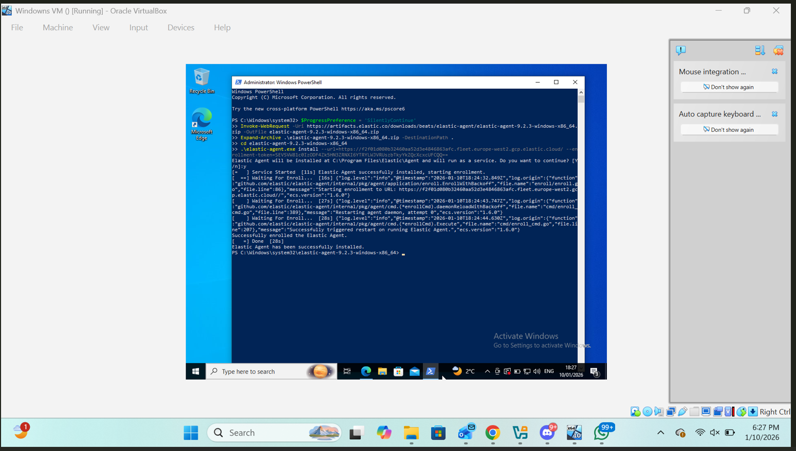
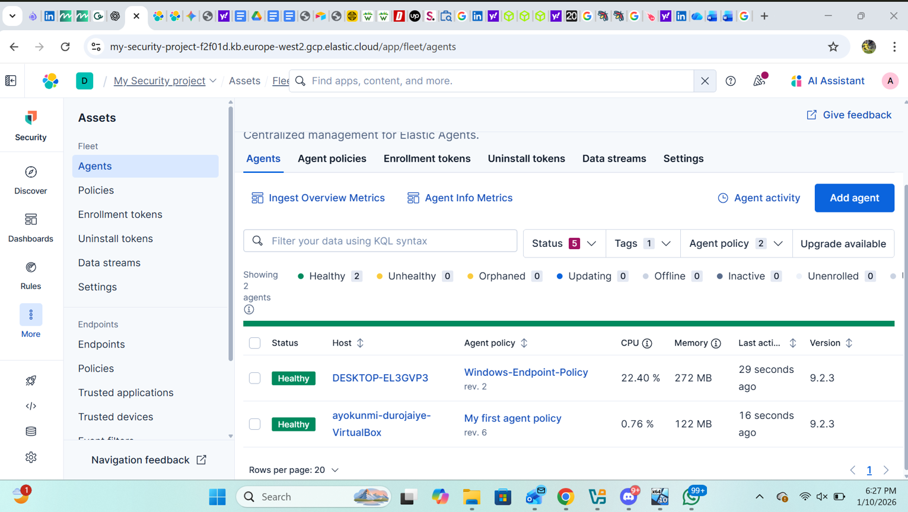
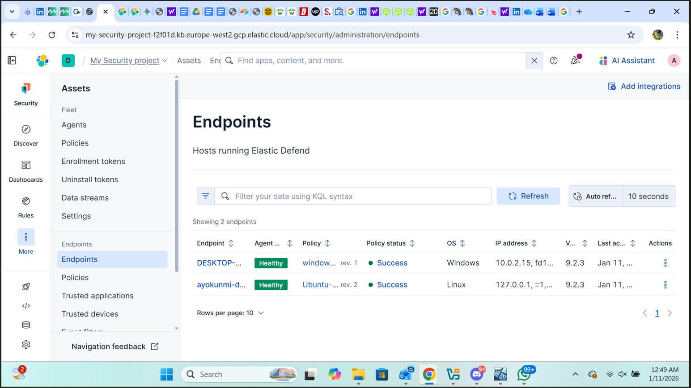
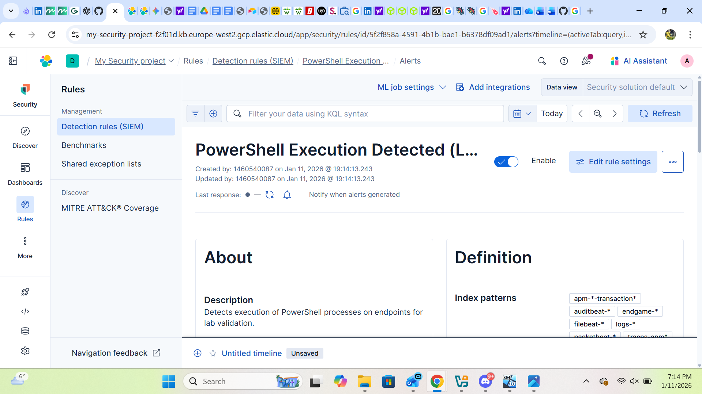
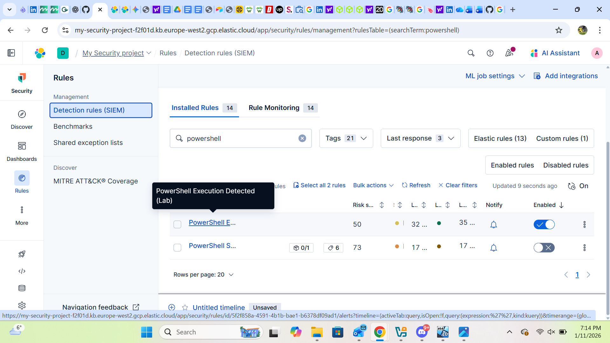
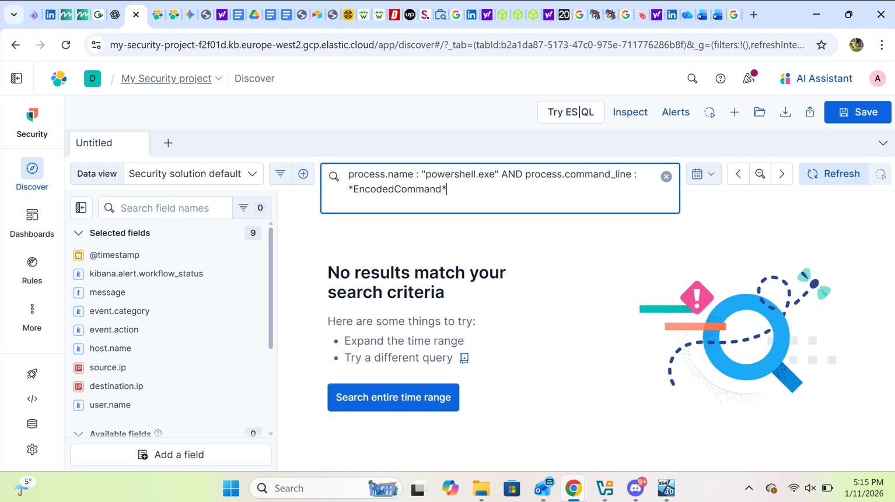

## Lab Walkthrough & Evidence

This section documents the key stages of the detection engineering lab, including environment setup, rule creation, and troubleshooting.

### 1. Elastic Agent Installation (Windows Endpoint)

Elastic Agent was manually installed and enrolled on a Windows 10 virtual machine to collect endpoint telemetry.

---

### 2. Fleet Agent Health Confirmation

The enrolled agents are visible in Fleet and reporting successfully, confirming data ingestion into Elastic Security.

---

### 3. Elastic Defend Endpoints Visibility

Elastic Defend is enabled, and endpoints are visible within the Security → Endpoints view.

---

### 4. PowerShell Detection Rule Creation

A custom SIEM detection rule was created to identify PowerShell execution activity on endpoints.

---

### 5. Detection Rule Enabled

The custom PowerShell detection rule is enabled and visible alongside other SIEM rules.

---

### 6. KQL-Based Troubleshooting in Discover

KQL was used in Discover to search for encoded PowerShell commands.  
Although no results were returned, this step demonstrates investigation and troubleshooting of why alerts may not fire due to telemetry availability or field mappings.

